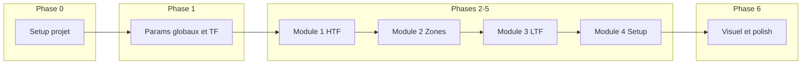

# Plan de guidage – Guide technique d’exécution

Ce fichier expose **toutes les informations pour l’exécution technique** de la mise en place du projet : cadre général, phases, **besoins précis et spécifiques de chaque étape**, et suivi des tâches (statut à faire / fait). Les **besoins et objectifs** (quoi faire, pourquoi) sont dans **PROJECT_GUIDE.md** (cahier des charges).

**Pour reprendre le travail** : 1) PROJECT_GUIDE.md (cahier des charges) ; 2) ce fichier (phases, sous-tâches, statut). Script à modifier : **`indicateur_mtf.pine`**.

---

## Comportement et rôle de l’agent

Le maître d’œuvre du projet est un **développeur senior** (25 ans d’expérience). L’agent est un **assistant de codage**, et non le maître d’œuvre du projet.

**Règles impératives :**

- **Pas d’initiative non demandée** : l’agent a **interdiction** de prendre des initiatives concernant des fonctionnalités qui n’auraient pas été demandées, ou d’adapter les méthodes sans que ce soit demandé.
- **Cadrage avant le code** : on commence toujours par **cadrer le besoin** par des explications ; l’agent ne commence à coder que sur **autorisation ou demande explicite et claire**.
- **Interdiction de coder sans accord** : l’agent a **interdiction de coder sans demande ou accord préalable**, sous peine de suppression.
- **Sérieux et proposition technique** : le travail est précis et technique ; l’agent doit faire preuve du **plus grand sérieux** dans ses démarches. Il doit **indiquer et expliquer** s’il a des solutions techniques plus adaptées pour résoudre des problématiques, sans les appliquer sans accord.

---

## 1. Langage et environnement technique

**Langage : Pine Script** (langage propriétaire TradingView pour indicateurs et stratégies).

- **Référence officielle :** [Pine Script Language Reference](https://www.tradingview.com/pine-script-reference/) (v5 et v6).
- **Version à cibler :** **v6** (dernière version ; dynamic requests pour `request.security()`, booléens stricts, indices négatifs sur les tableaux — adapté au projet MTF).
- **Contraintes utiles :** Pas de vrais « objets » ou dictionnaires ; on utilise des **arrays** typés (`array.new_float()`, etc.) et des **maps** (clé/valeur) pour stocker résultats par TF ou par module. Les boucles `for` et `while` sont disponibles pour itérer sur les TF.

**MTF (multi-timeframe) :**  
Données d’autres timeframes via `request.security(symbol, timeframe, expression, ...)` (v6 : requêtes dynamiques possibles). Paramètre **`lookahead`** à gérer pour limiter le repaint (souvent `barmerge.lookahead_off`). Le projet repose sur cette fonction pour alimenter chaque module (HTF puis LTF).

**Script unique :** `indicateur_mtf.pine`. Pas d’import de fichier dans TradingView : développement local puis **copier-coller** dans l’éditeur pour tester.

---

## 2. Vue d’ensemble du process

```
Phase 0 (Setup) → Phase 1 (Params + TF) → Phase 2 (Module 1 HTF) → Phase 3 (Module 2 Zones)
→ Phase 4 (Module 3 LTF) → Phase 5 (Module 4 Setup) → Phase 6 (Affichage / options) → Phase 7 (Revue)
```

Chaque phase s’appuie sur la précédente. **Avant de commencer chaque nouvelle phase**, on peut **produire** un guide détaillé pour cette phase (ex. GUIDE_PHASE_2.md) : objectifs, entrées, sous-tâches, méthodes, critères de fin. Ce guide est rédigé **au moment où on s’apprête à démarrer la phase**, pas à l’avance.



---

## 3. Objectif et livrable par phase

| Phase | Objectif en une phrase | Livrable principal |
|-------|------------------------|---------------------|
| **0** | Cadrer le projet et poser la structure minimale du script. | Cahier des charges (PROJECT_GUIDE), plan de guidage, script Pine avec `indicator()` et structure par modules (sans logique métier). |
| **1** | Implémenter la logique de sélection des timeframes (indice x, tf_htf, tf_ltf, is_htf_only). | Variables TF exposées et utilisables pour les modules ; optionnel : affichage TF/vue pour vérification. |
| **2** | Implémenter le Module 1 – Contexte HTF (tendance, BOS/CHoCH, zones de liquidité). | Données HTF via `request.security` ; sous-outils tendance, BOS/CHoCH, liquidité ; sorties (biais, BOS/CHoCH, zones) pour les modules suivants ; affichage associé. |
| **3** | Implémenter le Module 2 – Zones clés HTF (OB, FVG, Discount/Premium). | Détection et stockage des zones ; affichage rectangles + labels ; zones exposées pour modules 3 et 4. |
| **4** | Implémenter le Module 3 – Confirmation LTF (sweep, BOS/CHoCH LTF, retest OB/FVG). | Sorties booléennes/états pour le Module 4 ; affichage (flèches, labels, marqueurs de retest). Actif uniquement en vue LTF+HTF. |
| **5** | Implémenter le Module 4 – Setup / point d’entrée (agrégation des conditions, signal final). | Conditions biais / prix en zone / confirmation LTF ; agrégation ; affichage « Setup valide » si tout aligné. Actif uniquement en vue LTF+HTF. |
| **6** | Centraliser les options d’affichage et garantir la lisibilité. | Options par module (activer/désactiver, couleurs, transparence) ; pas de surcharge du graphique ; infos visibles même sans signal final. |
| **7** | Tester, ajuster et faire évoluer le plan. | Tests multi-instruments/TF ; mise à jour du plan et de la doc (méthodes, sous-étapes) ; éventuelle évolution 1 LTF / 2 HTF. |

---

## 4. Dépendances et ordre

- **Phase 0** : préalable à tout (cadre + script minimal).
- **Phase 1** : préalable à tous les modules (TF nécessaires pour `request.security` et pour savoir si on est en vue HTF ou LTF).
- **Phases 2 et 3** : s’appuient sur Phase 0 + 1 (contexte HTF et zones HTF).
- **Phase 4** : nécessite Module 2 (zones) pour le retest ; Phase 1 pour savoir si on est en vue LTF.
- **Phase 5** : nécessite Modules 1, 2 et 3 (biais, zones, confirmations LTF).
- **Phase 6** : après que les modules affichent déjà leurs éléments (idéalement après Phase 5).
- **Phase 7** : en continu ou en fin de cycle (tests, revue, évolution du plan).

---

## 5. Suivi des tâches (besoins précis par étape)

Ce plan est voué à **évoluer** : sous-étapes et méthodes pourront être détaillées ou réordonnées au fil du projet.

**Légende statut :** `[ ]` à faire · `[x]` fait · indiquer « en cours » en commentaire si besoin.

---

### Phase 0 – Setup projet (cadre + structure minimale)

- [x] Définir le cadre et les étapes (fichier de guidage, plan d’action)
- [x] Créer le fichier de guidage à la racine (PROJECT_GUIDE.md)
- [x] Décider de la version Pine (v6 — dernière version)
- [x] Poser un premier script Pine avec **uniquement la structure minimale nécessaire** : `indicator()`, paramètres vides ou minimaux, symbole = chart actuel, pas d’exécution automatique

---

### Phase 1 – Paramètres globaux et logique TF

**Référence détaillée :** PROJECT_GUIDE.md → section « Sélection des timeframes (logique centrale du projet) ».

- [ ] Ajouter l’input `tf_mode` (options : focus_ltf / focus_htf)
- [ ] Définir les tableaux `ltf_array` = [1, 5, 15, 60] et `htf_array` = [15, 60, 240, D]
- [ ] Implémenter la logique d’indice **x** : selon que `tf_graph` est seulement dans LTF, seulement dans HTF, ou dans les deux (alors `tf_mode` décide) → calcul de **x**, puis **ltf** = ltf_array[x], **htf** = htf_array[x]
- [ ] Exposer **is_htf_only** (vue HTF seule = contexte uniquement ; vue LTF = contexte HTF + raffinement LTF) et les variables **tf_ltf**, **tf_htf**
- [ ] (Optionnel) Afficher en label ou en table la TF du graphique, la vue (HTF seul / LTF+HTF), et les TF utilisées (LTF, HTF)

**Note :** Implémentation actuelle en **1 LTF / 1 HTF**. Passage à **1 LTF / 2 HTF** (ajout de htf2 = htf_array[x+1]) prévu dans un second temps.

---

### Phase 2 – Module 1 – Contexte HTF

Chaque sous-outil est **codé indépendamment**, puis intégré au module.

- [ ] **Données HTF** : utiliser `request.security()` pour récupérer les données nécessaires depuis les HTF
- [ ] **Sous-outil Tendance / structure** : détection HH/HL ou LH/LL, biais ; sorties réutilisables ; affichage labels (tendance/biais)
- [ ] **Sous-outil BOS/CHoCH HTF** : détection et sorties réutilisables ; affichage flèches BOS/CHoCH
- [ ] **Sous-outil Zones de liquidité** : Equal High/Low, anciens High/Low ; sorties réutilisables ; affichage rectangles ou liens
- [ ] Assembler les sorties du module (biais, BOS/CHoCH, zones liquidité) pour les modules suivants

---

### Phase 3 – Module 2 – Zones clés HTF

Chaque élément d’info est **codé indépendamment**, puis intégré au module.

- [ ] S’appuyer sur les données HTF (`request.security`) et, si besoin, sur le biais du Module 1
- [ ] **Sous-outil OB (Order Block)** : détection sur HTF ; stockage zones (coordonnées, type, force) ; affichage rectangles + labels (ex. « OB H1 »), couleur selon biais
- [ ] **Sous-outil FVG** : détection sur HTF ; stockage zones ; affichage rectangles + labels (ex. « FVG H1 »), couleur selon biais
- [ ] **Sous-outil Discount / Premium** : identification des zones ; stockage et affichage cohérents
- [ ] Exposer les zones (coordonnées, type, force) pour les modules 3 et 4

---

### Phase 4 – Module 3 – Confirmation LTF

Chaque élément est **codé indépendamment** et retourne ses états/sorties ; puis intégration au module.

- [ ] Utiliser les données LTF et les zones clés HTF (Module 2) pour les validations
- [ ] **Sous-outil Sweep** : détection ; sortie (booléen/état) ; affichage flèches, labels (« Sweep détecté »)
- [ ] **Sous-outil BOS/CHoCH LTF** : détection ; sorties réutilisables ; affichage
- [ ] **Sous-outil Retest OB/FVG** : validation retest des zones HTF ; sortie (retest validé ou non) ; affichage marqueurs de retest
- [ ] Exposer les sorties (sweep détecté, retest validé, etc.) pour le Module 4

---

### Phase 5 – Module 4 – Setup / point d’entrée

Chaque condition est traitée **indépendamment**, puis agrégée au signal final.

- [ ] **Condition biais HTF** : récupérer le biais du Module 1, exposer « aligné » ou non
- [ ] **Condition prix dans zone HTF clé** : croiser prix actuel et zones du Module 2, exposer « en zone » ou non
- [ ] **Condition confirmation LTF** : utiliser les sorties du Module 3 (sweep, retest, BOS/CHoCH LTF), exposer « validée » ou non
- [ ] **Agrégation** : signal final uniquement si toutes les conditions sont réunies
- [ ] Affichage : label « Setup valide », flèche directionnelle, résumé des éléments validés ; conserver l’affichage des modules 1–3 si pas de signal

---

### Phase 6 – Affichage pédagogique et options

- [ ] Centraliser les options d’affichage (activer/désactiver par module, couleurs, transparence)
- [ ] S’assurer que toutes les infos détectées restent visibles même sans signal final
- [ ] Vérifier la lisibilité (limites de zones affichées, nettoyage des anciens dessins si nécessaire)

---

### Phase 7 – Revue et évolution

- [ ] Tester sur plusieurs instruments et TF (1h/5m en focus_ltf, 4h/1h en focus_htf, etc.)
- [ ] Ajuster le plan : détailler sous-étapes, ajouter phases de refactor si besoin, documenter les méthodes (PROJECT_GUIDE.md ou fichier dédié)

---

## 6. Rappels utiles pour l’exécution

- **Langage** : Pine Script **v6**. Données MTF via `request.security()` ; gérer `lookahead` (souvent `barmerge.lookahead_off`) pour limiter le repaint.
- **Script unique** : `indicateur_mtf.pine`. Pas d’import de fichier dans TradingView : développement local puis copier-coller dans l’éditeur pour tester.
- **Référence des besoins** : PROJECT_GUIDE.md (sélection des timeframes, 4 modules, attentes par niveau, conventions).
- **Guide de phase** : avant de coder une phase, on peut rédiger puis utiliser un guide détaillé pour cette phase (ex. GUIDE_PHASE_2.md), produit au moment de démarrer la phase.

---

## 7. État actuel et prochaine étape

**État actuel :** Phase 0 terminée uniquement.

**Prochaine étape :** **Phase 1 – Paramètres globaux et logique TF** (tf_mode, ltf_array/htf_array, indice x, tf_ltf/tf_htf, is_htf_only). Puis Phase 2 – Module 1 (Contexte HTF) : `request.security()` sur `tf_htf`, tendance/structure, BOS/CHoCH, zones de liquidité. Détail des sous-tâches ci-dessus (§ 5, Phase 2).

**Référence :** [PROJECT_GUIDE.md](PROJECT_GUIDE.md) (cahier des charges, logique TF, modules).
