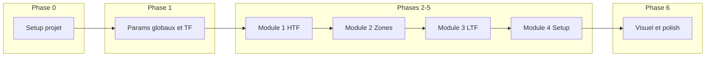

# Plan : Fichier de guidage et plan d'action indicateur TradingView

## 1. Langage et environnement

**Langage : Pine Script** (langage propriétaire TradingView pour indicateurs et stratégies).

- **Référence officielle :** [Pine Script Language Reference](https://www.tradingview.com/pine-script-reference/) (v5 et v6).
- **Version à cibler :** 
  - **v5** : documentation très complète, `request.security()` avec timeframe en string fixe ; stable pour un premier déploiement.
  - **v6** (déc. 2024) : permet des appels dynamiques à `request.security()` (séries de strings) dans des boucles et conditions, ce qui peut simplifier la logique MTF dynamique (TF choisies à la volée). À envisager après validation du flux HTF → LTF en v5 si besoin.
- **Contraintes utiles :** Pas de vrais "objets" ou dictionnaires ; on utilisera des **arrays** typés (`array.new_float()`, etc.) et des **maps** (clé/valeur) pour stocker résultats par TF ou par module. Les boucles `for` et `while` sont disponibles pour itérer sur les TF.

**MTF (multi-timeframe) :**  
Données d’autres timeframes via `request.security(symbol, timeframe, expression, ...)` (v5) ou équivalent v6. Paramètre `lookahead` à gérer pour limiter le repaint (souvent `barmerge.lookahead_off`). Le projet repose sur cette fonction pour alimenter chaque module (HTF puis LTF).

---

## 2. Fichier de guidage à créer

Créer un fichier unique (ex. **[PROJECT_GUIDE.md](PROJECT_GUIDE.md)** ou **GUIDAGE.md**) à la racine du projet, qui servira de référence pour toi et pour l’IA. Il doit intégrer le contexte général et les objectifs du prompt, sans détailler les algorithmes (ceux-ci seront définis module par module plus tard).

### Contenu proposé du fichier de guidage

- **Titre et objectif du projet**  
Indicateur TradingView modulaire, hiérarchique et dynamique pour l’analyse visuelle et la décision (setups à haute probabilité). Pas de trading automatique.
- **Principes directeurs**  
  - Construction progressive : HTF → LTF → signal final.  
  - Pédagogie : affichage de toutes les infos détectées (zones, structure, confirmations), même sans signal final, pour que le trader comprenne pourquoi un setup est valide ou non.  
  - Modularité : chaque module (Contexte HTF, Zones clés HTF, Confirmation LTF, Setup/entrée) est conçu pour être développé et testé de façon relativement indépendante.
- **Langage et doc**  
  - Pine Script (v5 recommandé en premier, v6 possible pour évolutions MTF dynamiques).  
  - Liens vers la doc officielle et, si utile, vers les pages Timeframes / `request.security`.
- **Sélection des timeframes** — Logique centrale du projet. **Détail complet dans [PROJECT_GUIDE.md](PROJECT_GUIDE.md), section « Sélection des timeframes »** (indice x, ltf_array/htf_array, tf_mode, is_htf_only, 1 LTF / 1 HTF puis 1 LTF / 2 HTF). Rappel :  
  - `tf_mode` : `"focus_ltf"` (scalp/day) ou `"focus_htf"` (swing/long terme).  
  - Tableaux TF : LTF = [1m, 5m, 15m, 1h], HTF = [15m, 1h, 4h, 1d]. TF communes 15m/1h dont le rôle dépend de `tf_mode`.
- _Rappel logique TF (détail dans PROJECT_GUIDE)_  
  - TF principale choisie par l’utilisateur ; rôle (LTF ou HTF) selon `tf_mode`.  
  - TF correspondantes : pour une LTF → les 2 HTF supérieures ; pour une HTF → LTF inférieures pour confirmations.  
  - Règles d’usage : HTF = structure, OB/FVG, liquidité, BOS/CHoCH ; LTF = sweep, BOS/CHoCH, retest.
- **Les 4 modules (objectifs uniquement, pas les méthodes)**  
  - Module 1 – Contexte HTF : structure, biais, BOS/CHoCH HTF, zones de liquidité.  
  - Module 2 – Zones clés HTF : OB, FVG, Discount/Premium.  
  - Module 3 – Confirmation LTF : validation des zones HTF (sweep, BOS/CHoCH LTF, retest OB/FVG).  
  - Module 4 – Setup / point d’entrée : agrégation des conditions ; signal final uniquement si tout est validé.
- **Conventions de code (à compléter au fil du projet)**  
  - Nommage des variables/fonctions (ex. préfixe par module : `ctxHTF_`*, `zonesHTF_*`, etc.).  
  - Organisation du script : blocs par module, paramètres en tête.  
  - Affichage : `label.new()`, `plotshape()`/`plotarrow()`, `box.new()` ; couleurs/transparence selon type et force de zone.
- **Évolution du projet**  
  - Déploiement étape par étape ; les méthodes (détection de BOS/CHoCH, OB, FVG, sweep, retest, etc.) seront précisées par module au fur et à mesure.  
  - Ce fichier et le plan d’action peuvent être mis à jour à chaque phase.

Référence du prompt source : [tradingview_indicator_prompt.txt](tradingview_indicator_prompt.txt).

---

## 3. Plan d’action détaillé (étape par étape)

Ce plan est voué à évoluer : on pourra détailler ou réordonner les sous-étapes, et ajouter les méthodes concrètes (algorithmes) au moment du codage de chaque module.

- **Phase 0 – Setup projet**  
  - Créer le fichier de guidage (contenu ci-dessus) à la racine.  
  - Décider de la version Pine (v5 recommandée en premier).  
  - Créer un premier script Pine (ex. `indicateur_mtf.pine` ou nom choisi) avec déclaration `indicator()` et paramètres d’entrée vides ou minimaux (symbole = chart actuel, pas d’exécution automatique).
- **Phase 1 – Paramètres globaux et logique TF** — Référence : [PROJECT_GUIDE.md](PROJECT_GUIDE.md) (sélection TF). Actuellement 1 LTF / 1 HTF ; évolution 1 LTF / 2 HTF prévue.  
  - Ajouter l’input `tf_mode` (options : focus_ltf / focus_htf).  
  - Définir les tableaux de TF (LTF et HTF) en constantes ou inputs.  
  - Implémenter la logique qui, à partir de la TF du graphique (ou d’un input TF principale), détermine :  
    - si on est en “mode LTF” ou “mode HTF” pour cette TF ;  
    - quelles sont les TF “correspondantes” (2 HTF au-dessus ou LTF en dessous).
  - (Optionnel) Afficher en label ou en table la TF principale et les TF utilisées pour HTF/LTF, pour vérification.
- **Phase 2 – Module 1 – Contexte HTF**  
  - Définir les **méthodes** de ce module (à préciser au moment du codage) : détection de la structure (HH/HL ou LH/LL), BOS/CHoCH sur les HTF choisies, zones de liquidité (Equal High/Low, anciens High/Low).  
  - Utiliser `request.security()` pour récupérer les données nécessaires depuis les HTF.  
  - Produire des sorties réutilisables (variables ou structures en array/map) : biais, derniers BOS/CHoCH, zones de liquidité.  
  - Ajouter l’affichage : labels (tendance/biais), flèches BOS/CHoCH, rectangles ou liens pour les zones de liquidité.
- **Phase 3 – Module 2 – Zones clés HTF**  
  - Définir les **méthodes** : détection OB et FVG sur les HTF, identification des zones Discount/Premium.  
  - S’appuyer sur les données HTF (request.security) et, si besoin, sur le biais du Module 1.  
  - Stocker les zones (coordonnées, type, force) pour usage par les modules 3 et 4.  
  - Affichage : rectangles colorés avec labels (ex. “OB H1”, “FVG H1”), couleur selon biais.
- **Phase 4 – Module 3 – Confirmation LTF**  
  - Définir les **méthodes** : détection sweep, BOS/CHoCH LTF, retest des OB/FVG issus du Module 2.  
  - Utiliser les données LTF (request.security si besoin) et les zones clés HTF pour valider les retests.  
  - Sorties : indicateurs booléens ou états (sweep détecté, retest validé, etc.).  
  - Affichage : flèches, labels explicatifs (“Sweep détecté”), marqueurs de retest.
- **Phase 5 – Module 4 – Setup / point d’entrée**  
  - Agrégation des conditions : biais HTF aligné + prix dans une zone HTF clé + confirmation LTF validée.  
  - Génération du signal final uniquement si toutes les conditions sont réunies.  
  - Affichage : label “Setup valide”, flèche directionnelle, résumé court des éléments validés (texte ou icônes).  
  - Si conditions non réunies : conserver l’affichage des infos des modules 1–3 (déjà prévu par le principe pédagogique).
- **Phase 6 – Affichage pédagogique et options**  
  - Centraliser les options d’affichage (activer/désactiver par module, couleurs, transparence).  
  - S’assurer que toutes les infos détectées restent visibles même sans signal final.  
  - Vérifier la lisibilité (éviter surcharge du graphique : limites de zones affichées, nettoyage des anciens dessins si nécessaire).
- **Phase 7 – Revue et évolution**  
  - Tester sur plusieurs instruments et TF (1h/5m en focus_ltf, 4h/1h en focus_htf, etc.).  
  - Ajuster le plan : détailler les sous-étapes, ajouter des phases de refactor (ex. passage à v6 pour TF dynamiques), documenter les méthodes dans le fichier de guidage ou dans un fichier dédié (ex. METHODES.md) au fur et à mesure.

---

## 4. Livrables de cette session (après validation du plan)

- **Un fichier de guidage** ([PROJECT_GUIDE.md](PROJECT_GUIDE.md) ou [GUIDAGE.md](GUIDAGE.md)) contenant les sections décrites en §2.  
- **Un plan d’action** conservé soit dans ce fichier de guidage (section “Plan d’action”), soit dans un fichier séparé ([PLAN_ACTION.md](PLAN_ACTION.md)) reprenant les phases 0 à 7 avec cases à cocher ou statut (à faire / en cours / fait), pour suivi et modifications futures.

Aucun code Pine n’est écrit dans cette phase ; le premier script et le contenu exact des méthodes seront définis lors des phases 0 et 1, puis module par module.